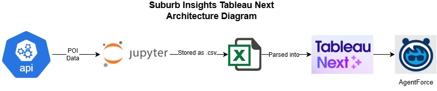
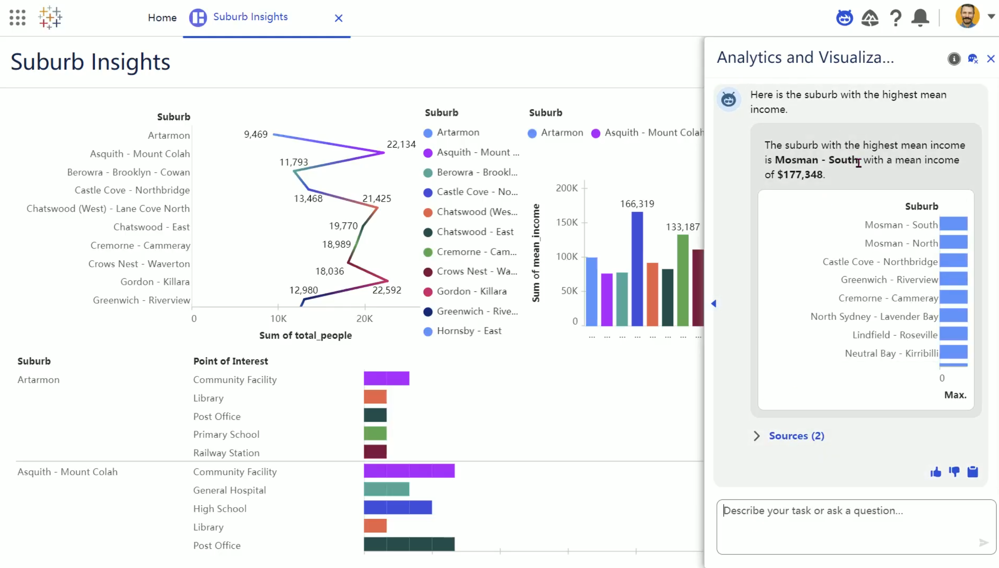

# suburb-insight-tableau
This project aims to provide new immigrants with insights on various suburbs in NSW based on mean income, population count, and number of points of interests e.g. libraries, schools etc with **Tableau Next** and **AgentForce**.

**Demo YouTube Link:** https://youtu.be/czWq6m2Xxp4

**Architecture Diagram**

**Dashboard Demo**

## **Inspiration**

Moving to a new country can be overwhelming, especially when trying to decide where to live. While information on property prices and crime rates is widely available, details on local amenities like schools, libraries, shopping centres, transport interchanges and hospitals are often difficult to access. These factors, however, are crucial for immigrants seeking a community that supports their lifestyle and needs. This gap in accessible information inspired the creation of Suburb Insights for Immigrants—a tool to make these details more visible and easier to explore.

## **What it does**

The dashboard provides a visual, user-friendly way for immigrants to explore suburbs in NSW, with a focus on the Sydney North Shore and Hornsby areas. It displays:
- **Number of points of interest (POI)** including schools (primary, high, combined primary-secondary), libraries, shopping centres, transport interchanges, railway stations, hospitals, and post offices
- **Mean income per suburb**
- **Population per suburb**

In addition, users can interact with AgentForce, an AI agent that answers natural-language questions such as:
- “Which suburb has the highest mean income?”
- “How many schools are in Pymble?”

This makes the dashboard both informative and accessible, even to those unfamiliar with data tools.

## **How we built it**

- **Data sourcing:** POI data was retrieved from the NSW POI API. Income and population data were integrated from official government statistics.
- **Dashboard development:** Tableau Next was used to design a clean, interactive dashboard that allows users to filter and compare suburbs.
- **AI integration:** AgentForce was connected to the dataset, enabling natural-language querying for insights.

## **Challenges we ran into**

- **Data size:** The full dataset across NSW was too large to process effectively, so only a subset (Sydney North Shore and Hornsby) was used for this prototype.
- **Balancing simplicity with depth:** The goal was to create a tool that is easy for immigrants to use, without overwhelming them with technical details.

## **Accomplishments that we're proud of**

- Building a proof of concept that allows access to elusive information. POI data is only available with API integration.
- Combining graphical insights with AI-powered querying, bridging the gap between traditional dashboards and conversational data interaction by leveraging Tableau Next.
- Designing with immigrants in mind, focusing on factors that directly impact daily life.

## **What we learned**

- The importance of choosing the right variables- not just those easily available, but those that actually matter to the end users.
- How to manage large datasets by prototyping with a focused subset before scaling up.
- The value of AI integration in making dashboards more intuitive and approachable.

## **What's next for Suburb Insights for Immigrants**

- Potentially expand coverage beyond Sydney North Shore and Hornsby to include all NSW suburbs.
- Incorporate additional factors e.g. businesses, industries
- Develop a mobile-friendly version for easier access by new arrivals.
- Collaborate with community organisations to ensure the tool aligns with the real needs of immigrants.
